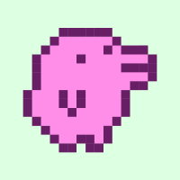
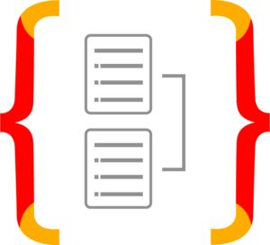

<h1 align="center">Hello, People ! Welcome to my profile! 👨🏻‍💻</h1>

 
## 👨🏻‍🦱 About me:
<ul>
  <li>🔭 Aiming to become a great Full-Stack Developer</li>
  <li>🤝 I strongly believe that programming can change people's lives and for that reason I'm always looking to improve myself more and more.</li>
  <li>🚀 Creator and mantainer of <a href="/stardust.com">StarDust</a></li>
  <li>📚 My focus is studying and expanding my knowledge in web development. I've also had contact with and some other areas like mobile development and AI, but only to expand my range of possibilities and, of course, out of curiosity 😜</li>
  <li>🐍 I'm currently studying Python</li>
</ul>

 

## 🛠️ Technologies I've had contact with:

<table>
  <tr>
    <td align="center" width="96">
      
      HTML
    </td>
    <td align="center" width="96">
      
      CSS
    </td>
    <td align="center" width="96">
      
      JavaScript
    </td>
    <td align="center" width="96">
      
      TypeScript
    </td>
    <td align="center" width="96">
      
      TailwindCSS
    </td>
    <td align="center" width="96">
      
      Sass
    </td>
    <td align="center" width="96">
      
      HTMX
    </td>
     <td align="center" width="96">
      
      Boostrap
    </td>
  </tr>
  <tr>
     <td align="center" width="96">
      
      React
    </td>
    <td align="center" width="96">
      
      NextJs
    </td>
     <td align="center" width="96">
      
      Astro
    </td>
    <td align="center" width="96">
      
      React Native
    </td>
    <td align="center" width="96">
      
      Expo
    </td>
    <td align="center" width="96">
      
      Tamagui
    </td>
    <td align="center" width="96">
      
      GlueStack UI
    </td>
    <td align="center" width="96">
      
      Styled Components
    </td>
  </tr>
  <tr>
    <td align="center" width="96">
      
      PHP
    </td>
      <td align="center" width="96">
      
      MySQL
    </td>
    <td align="center" width="96">
      
      PostgreSQL
    </td>
    <td align="center" width="96">
      
      Python
    </td>
    <td align="center" width="96">
      
      Flask
    </td>
    <td align="center" width="96">
      
      Supabase
    </td>
    <td align="center" width="96">
      
      Firebase
    </td>
     <td align="center" width="96">
      
      Docker
    </td>
  </tr>
  <tr>
     <td align="center" width="96">
      
      Express
    </td>
     <td align="center" width="96">
      
      Fastfy
    </td>
     <td align="center" width="96">
      
      Elysia
    </td>
     <td align="center" width="96">
      
      Bun
    </td>
     <td align="center" width="96">
      
      TypeOrm
    </td>
     <td align="center" width="96">
      
      Prisma
    </td>
    <td align="center" width="96">
      
      Webpack
    </td>
      <td align="center" width="96">
      
      Figma
    </td>
  </tr>
</table>
 
 

## 📲 Contact me
  
  
   
 

## ✨ Github Streak

## Visitors Count
  
